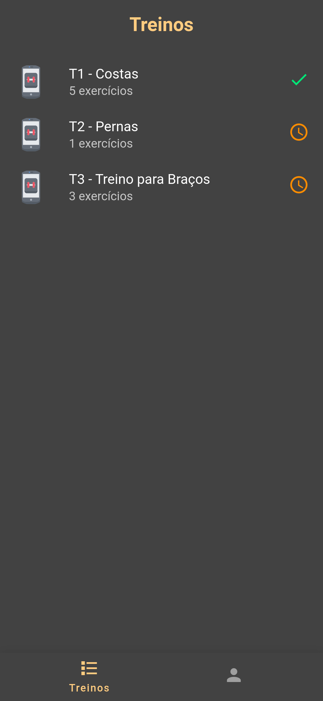
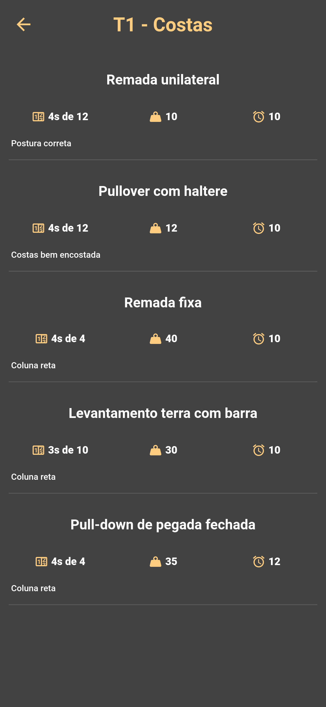
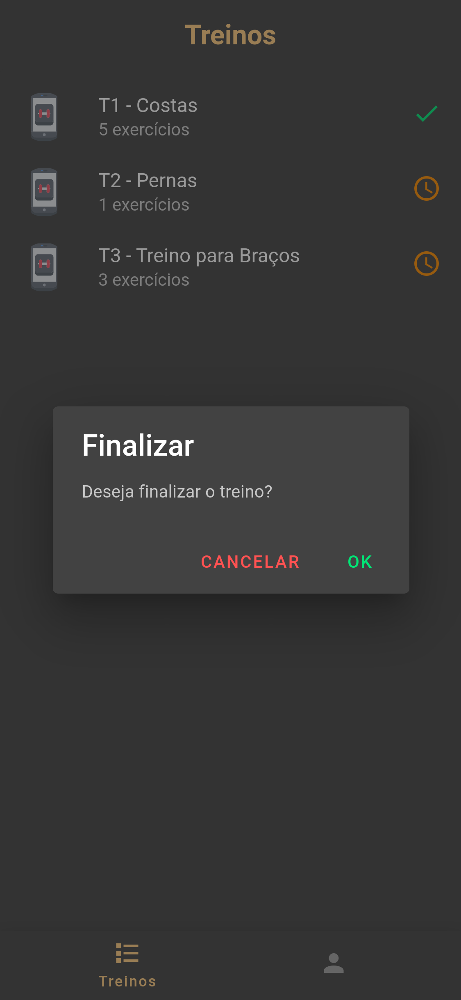
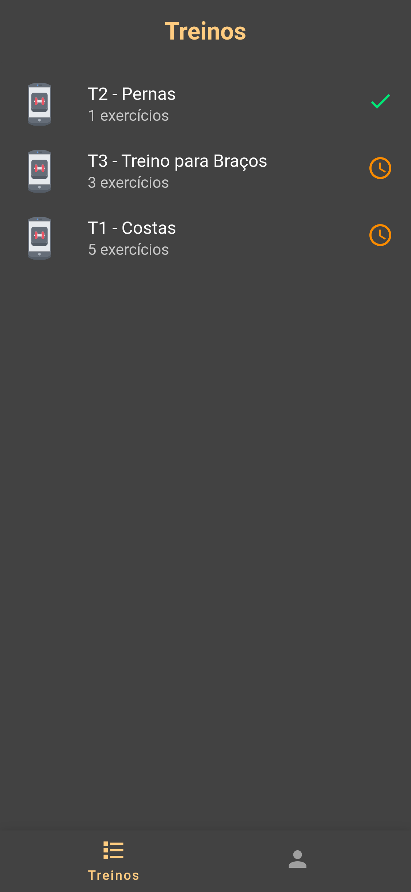
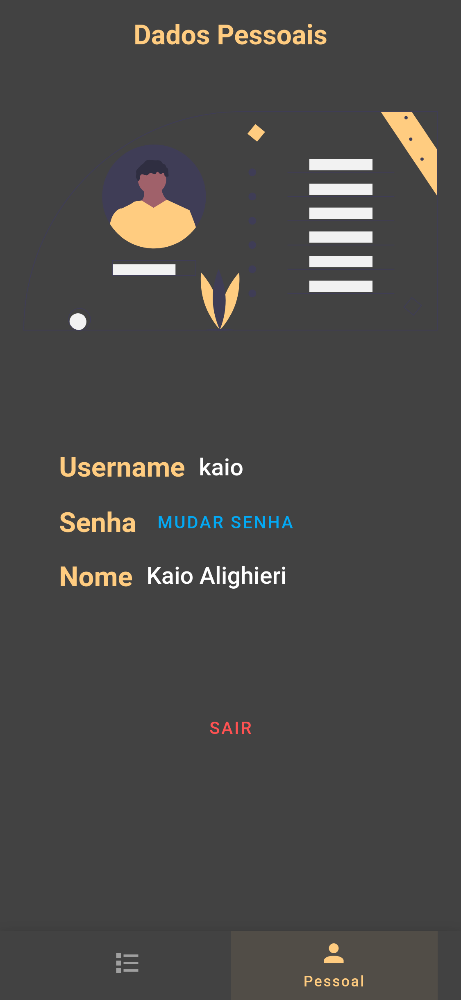
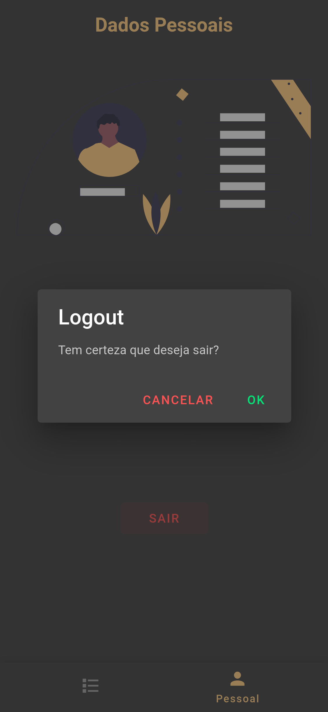

# App - Ficha Academia

## Tecnologias
* Vue
* Vuetify
* Pwa
* Node

## Tela de Login

 

## Home

 

## Exercícios

 

## Finalizar treino

 

## Nova ordernação

 

## Dados Pessoais

 

## Mudar senha

 

## Logout

 

